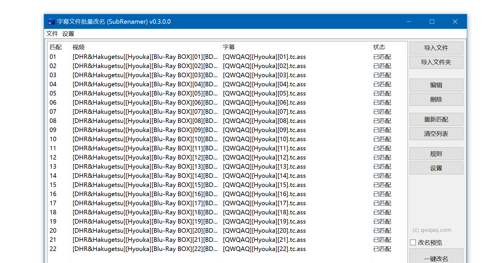



# SubRenamer

> 番剧字幕文件自动化一键批量重命名（改名）工具

> Rename Subtitle Filenames Automatically to Match Videos Easily through the Sight Tool.

**目的？** 重命名番剧外挂的字幕文件名，使之与视频文件名相对应

**为何？** 若视频文件名与字幕文件名一一对应（文件名相同），任何视频播放器都可以自动载入字幕。

   

## 对比普通批量改名软件，有何异同？

SubRenamer 专注于字幕文件改名，简单易用。

对于大多数视频与字幕文件，您仅需将其拖入程序，即可自动精准地识别，一键改名，省去了普通改名软件较为繁杂的设置操作。

## 如何拥有 SubRenamer ?

  
  
点我查看

  
  
获取最新版程序，可到 [Releases](https://github.com/qwqcode/SubRenamer/releases/latest) 页

速度慢？请: https://www.lanzous.com/iak59ji (密码:huaji)

> P.S. 程序依赖 NET >= 4.5 的运行环境，请先下载安装：https://dotnet.microsoft.com/download (若为 Win10 用户，请无视此操作)

## 如何食用

可见：[哔哩哔哩传送门](https://www.bilibili.com/video/BV1e7411y7rG)

## 特性

- 体积小巧 (~1MB)
- 操作简单
- 拖拽文件导入
- 一键改名【真】
- 自动匹配（无需导入顺序）
- 手动匹配（精确匹配）
- 正则表达式匹配（复杂需求）
- 支持 备份原字幕
- 支持 导出为命令行命令

## 原理解释

  
  
为什么 SubRenamer 能准确识别您的文件：

  
### 自动匹配模式

“自动匹配”是指：通过对比 **两个**字幕或视频的**文件名** 之间的差异，**来确定**“集数”的**位置**，从而**较为准确**地将视频文件与字幕文件**关联**起来，达到“**一键改名**”的目的。

这就意味着：您需要导入至少两个视频文件和两个字幕文件，才能进行自动匹配。

### 手动匹配模式

例如，您遇到了这样的情况，一个视频有**多种**语言的**字幕文件**，而这些**字幕文件**又存在于**同一个**文件夹中，导致**无法**通过“自动匹配”模式**准确关联**视频和字幕，则可以使用手动匹配模式。

## 使用场景

请听 ABCDE 的故事：

> (缩减版) 小A下载了一部新更的生肉番，又从字幕网站下载到了一套字幕文件，生肉番的 视频文件名 常常和 字幕文件名 不一致，看番时需要手动选定字幕，下次打开又得重新选定。小A拥有了 **SubRenamer**，从此改名交给他来做，终于可以安安心心看番啦。

> (探究版) 小B今天下载了一部番剧，小B因不会他国语言从而需要找寻一套字幕。小B下载到了字幕，但因 字幕文件名 与 视频文件名 不相对应，播放器无法自动载入字幕文件，小B因每次都要手动选择字幕文件而烦恼万分。最终，小B实在受不鸟了，毅然决然决定修改文件名...... 所以问题来了，小B如何才能快速地修改字幕文件名，而不是一个一个慢慢地手动修改呢？？？

> (激情版) 小C热爱学习，小C下载了一套100000000集的学习视频，提升自我人生价值的大好机会到了，准备今天晚上就开淦(darkbubi)，可到了晚上，小C打开下载好的视频时却突然想起，自己什么也(bing)听(bu)不(xiang)懂(xue)（此刻的小C对于学习的热情瞬间熄灭）。可是突然！小C发现了 **SubRenamer**，下载一套字幕后，修改按钮一敲，100000000集的学习视频字幕文件顺利加载，小C对于学习的热情死(bu)灰(ke)复(neng)燃(di)

> (慵懒版) 小D拥有了 **SubRenamer** 后，字幕文件改名的操作全交给 **SubRenamer**，省去了大量时间可以留给睡觉。

> (蜜汁版) 小E . .o. 0。.O . 。o.

> (稽智版) 小F选择重新下载内挂字幕的番剧 lol

## FAQ

  
Q: 如果我的字幕有多种语言的版本，在同一个文件夹内，无法识别怎么办？

A: 您可以使用手动匹配模式，或者手动选中其中一个语言并拖入程序中即可识别。

  
## 特别鸣谢

[【小众软件】SubRenamer – 字幕批量重命名，自动匹配视频文件与字幕文件[Windows]](https://www.appinn.com/subrenamer-for-windows)

## 有 BUG?

可在 [issues 页](https://github.com/qwqcode/SubRenamer/issues) 进行反馈，或发 Email 到 qwqcode@qq.com 联系我，欢迎反馈~~

## 捐助

如果您觉得我的项目对您有帮助，并且您愿意给予我一点小小的支持，您可以通过以下方式向我捐助，这样可以维持项目的持续发展，非常感谢！(/ω＼)

| Alipay | Wechat | 
| :------: | :------: | 
|  |  | 

捐助者的名字将保存于 [捐助者名单](https://github.com/qwqcode/donate-qwqaq)

最后，我再次对您致以最最最诚挚的感谢！
